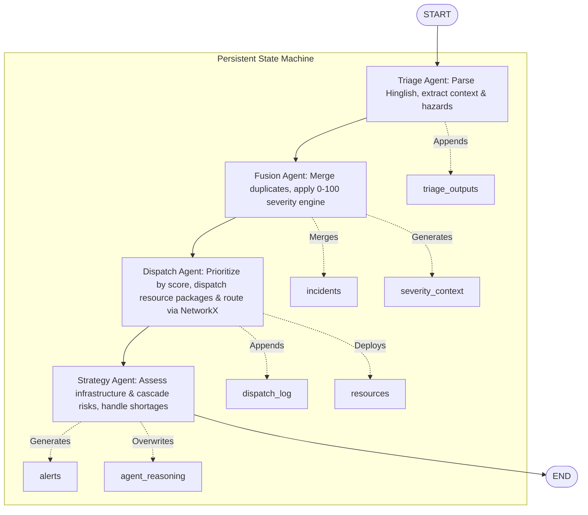

# CrisisGrid AI

An intelligent, multi-agent emergency dispatch system powered by **LangGraph**, **FastAPI**, **Next.js 15**, and **NetworkX**.

CrisisGrid AI simulates a real-time smart city command center that autonomously triages 112 calls, merges duplicate reports, calculates dynamic severity scores (0-100), allocates resources, and reroutes units based on active traffic and hazard conditions. It features a modern, high-performance EOC (Emergency Operations Center) dashboard.

---

## 🚀 Engineering Impact: CAR (Cause, Action, Result) Summary

- **Cause (Challenge):** Solved critical emergency dispatch delays caused by unstructured, high-volume Hinglish calls and redundant multi-party crisis reports in high-density urban areas.
- **Action (Implementation):** Engineered a decoupled full-stack multi-agent system using [LangGraph](file:///Users/priyalsarda/Documents/AI%20Projects/CrisisGrid%20AI/graph/workflow.py), [NetworkX](file:///Users/priyalsarda/Documents/AI%20Projects/CrisisGrid%20AI/graph/workflow.py), FastAPI WebSockets, and Next.js 15 for autonomous triage, incident fusion, and shortest-path resource routing.
- **Result (Impact):** Enabled real-time 0-100 severity-based dispatch prioritization, dynamic low-to-critical resource preemption, and high-density EOC Command Center dashboard visualization.

---

## 🗺️ System Architecture & Workflow

The system operates as a highly scalable, decoupled full-stack architecture. State is orchestrated via **LangGraph**, processed in **FastAPI**, and synchronized in real-time to a **Next.js 15** frontend.



---

## 🧠 Core Intelligence Layer (LangGraph Agents)

The [workflow](file:///Users/priyalsarda/Documents/AI%20Projects/CrisisGrid%20AI/graph/workflow.py) coordinates four autonomous agents to transition the emergency [State](file:///Users/priyalsarda/Documents/AI%20Projects/CrisisGrid%20AI/utils/state.py) from raw call to strategic action:

### 1. [Triage Agent](file:///Users/priyalsarda/Documents/AI%20Projects/CrisisGrid%20AI/agents/triage_agent.py)
- **Role:** Parses raw, unstructured emergency transcripts (supporting conversational Hinglish).
- **Execution:** Uses `llama-3.3-70b-versatile` with JSON response formatting to structure key signals:
  - Incident Type (fire, chemical spill, explosion, medical, accident)
  - Casualties & Trapped count
  - Hazard indicators (`has_chemical_hazard`, `has_industrial_context`, `has_spread_risk`, `is_multi_casualty`)
  - Vague location resolution into discrete city zones.

### 2. [Fusion Agent](file:///Users/priyalsarda/Documents/AI%20Projects/CrisisGrid%20AI/agents/fusion_agent.py)
- **Role:** Correlates and deduplicates rapid-fire caller reports of the same ongoing event.
- **Execution:** Performs LLM-driven merging of details into a master incident while aggregating caller summaries. Tracks `duplicate_count` and calculates a `confidence_score` (corroboration confidence) that feeds directly into the severity engine.

### 3. [Dispatch Agent](file:///Users/priyalsarda/Documents/AI%20Projects/CrisisGrid%20AI/agents/dispatch_agent.py)
- **Role:** Allocates multi-resource units (Ambulance, Fire Truck, Police) to the highest-priority active incident.
- **Execution:** Prioritizes incidents using their dynamic `severity_score` (0-100) instead of raw status tiers. Under resource deficits, it triggers **dynamic preemption**, pulling units from active LOW/MEDIUM-priority incidents to reroute them to HIGH/CRITICAL emergencies. ETAs and routing paths are computed using a real-time city graph.

### 4. [Strategy Agent](file:///Users/priyalsarda/Documents/AI%20Projects/CrisisGrid%20AI/agents/strategy_agent.py)
- **Role:** Reviews systemic capacity and provides high-level disaster strategy and risk mitigation planning.
- **Execution:** Detects capacity depletion (e.g. system utilization $\ge 75\%$), deficits in available resource types, and potential cascading hazards (e.g., a fire adjacent to chemical sites or critical transport routes). Generates structured LLM outputs explaining tradeoffs, decisions, and mutual aid requirements.

---

## 🛠️ Engineering Highlights & Algorithms

### 1. Multi-Factor Severity Scoring Engine
Unlike binary emergency sorting, CrisisGrid AI uses a highly detailed [Severity Engine](file:///Users/priyalsarda/Documents/AI%20Projects/CrisisGrid%20AI/data/severity_engine.py) that evaluates ten risk factors with precise weights to compute a dynamic score between `0-100`:

| Risk Factor | Weight | Explanation |
| :--- | :---: | :--- |
| **Incident Type Base** | `22%` | Intrinsic danger of category (e.g., chemical explosion = 96, medical = 40) |
| **Casualty Factor** | `18%` | Logarithmic scaling based on reported injured and trapped counts |
| **Spread Risk** | `10%` | Probability of the threat expanding (e.g., chemical fire = 95%) |
| **Hazmat Risk** | `10%` | Evaluates raw hazmat flags amplified by chemical sites in the zone |
npm run build| **Infrastructure Criticality** | `10%` | Importance of the location zone (e.g., Airport, Harbor, Port = high importance) |
| **Population Density** | `8%` | Vulnerability of the zone based on urban occupancy |
| **Time Sensitivity** | `7%` | Critical windows (e.g., cardiac arrest / structural collapse require immediate ETAs) |
| **Corroboration Confidence** | `5%` | Amplified by duplicate reports confirming the emergency |
| **Cascade Probability** | `5%` | Likelihood of triggering secondary industrial or structural failures |
| **Evacuation Difficulty** | `5%` | Difficulty rating of rescuing and evacuating the zone |

```
0 - 35  → LOW Severity
36 - 65 → MEDIUM Severity
66 - 85 → HIGH Severity
86 - 100 → CRITICAL Severity
```

### 2. NetworkX Directed City Graph Engine
Real-time routing is built on top of a NetworkX directed graph representing the city’s transit sectors:
- **Dynamic travel times:** Base travel weights between zones are modified in real-time.
- **Hazard inflation:** Active incidents (e.g., floods, fire perimeters, toxic plumes) dynamically inflate transit costs (ETAs) or establish complete roadblocks.
- **Nearest-unit selection:** Resolves shortest paths from all available resource nodes to target incident zones using Dijkstra's algorithm.

---

## 💻 Presentation Layer (Next.js 15 EOC Dashboard)

The front-end EOC (Emergency Operations Center) dashboard represents a high-density Security Operations Center:

- **State Synchronization:** Fully synchronized via **Zustand** matching the FastAPI backend data models perfectly.
- **Auto-Reconnecting WebSockets:** Automatically reconnects and streams real-time updates of agent reasoning, new incidents, resource status changes, and dispatch logs.
- **Leaflet Live Map:** Plotting active, pulsing incidents, localized risk factors, and custom path animations showing unit dispatch trajectories.
- **LLM Reasoning Terminal:** A high-contrast console streaming the autonomous thoughts of the LangGraph agents during the decision lifecycle.

---

## 🏁 Getting Started

### 1. Prerequisites
- **Backend:** Python 3.10+
- **Frontend:** Node.js 18+ and `npm`
- A valid **Groq API Key** (`llama-3.3-70b-versatile` & `llama-3.1-8b-instant`)

### 2. Backend Setup
1. Clone the repository and navigate to the project directory:
   ```bash
   git clone https://github.com/yourusername/crisisgrid-ai.git
   cd crisisgrid-ai
   ```
2. Install Python dependencies:
   ```bash
   pip3 install -r requirements.txt
   ```
3. Create a `.env` file in the root directory:
   ```env
   # ── API Keys ──
   GROQ_API_KEY=your_groq_api_key_here

   # ── Backend Settings ──
   HOST=0.0.0.0
   PORT=8000
   DEBUG=false
   ENV=production
   CORS_ORIGINS=*
   ```
4. Start the production FastAPI server:
   ```bash
   python3 run_server.py
   ```
   The backend API will run at `http://localhost:8000`. Detailed Swagger docs are at `http://localhost:8000/docs`.

### 3. Frontend Setup
1. Open a new terminal window and enter the frontend workspace:
   ```bash
   cd frontend
   ```
2. Install Node dependencies:
   ```bash
   npm install
   ```
3. Launch the Next.js development server:
   ```bash
   npm run dev
   ```
   Access the dashboard at `http://localhost:3000`.

---

## 🧪 Testing the AI Simulation

CrisisGrid AI contains a [Simulation Runner](file:///Users/priyalsarda/Documents/AI%20Projects/CrisisGrid%20AI/backend/simulation/runner.py) to demonstrate its coordination and dispatch intelligence:

- **Simulation Controls:** You can trigger simulations directly from the Next.js dashboard panel.
- **Direct API Invocations:** Alternatively, fire up scenarios using `cURL`:
  ```bash
  curl -X POST "http://localhost:8000/api/v1/simulation/scenario" \
       -H "Content-Type: application/json" \
       -d '{"delay": 1.5}'
  ```

### What to watch for:
1. **Triage:** Parsing rapid emergency calls reported in conversational Hinglish.
2. **Deduplication:** Multiple calls regarding a fire in the industrial zone are successfully fused into a single master incident.
3. **Escalation:** The Fusion Agent dynamically upgrades incident severity when multiple corroborations hit high-risk zones.
4. **Dynamic Preemption:** The Dispatch Agent automatically pulls an ambulance from a low-priority incident to route it to a critical chemical hazard.

---

## 🔗 Deployment

- **Backend:** Ready for deployment to platforms like Render or Railway using `run_server.py`. Ensure `CORS_ORIGINS` points to your client domain.
- **Frontend:** Optimized for Vercel deployment. Ensure `NEXT_PUBLIC_WS_URL` and `NEXT_PUBLIC_API_URL` point to your live backend domain (utilizing secure `wss://` WebSockets).
